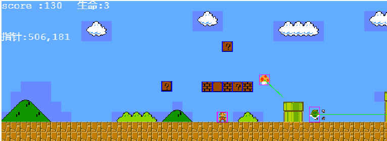
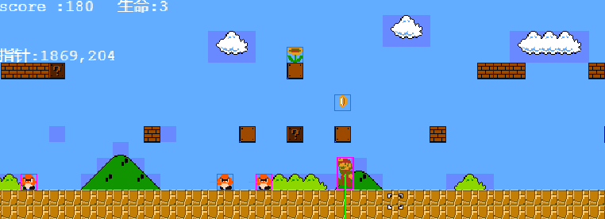
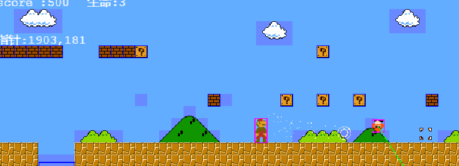

# phaser3-mario
A simple mario game,created by Phaser3

在线地址 https://tyrone2333.github.io/phaser3-mario/build/

## 效果演示
### koopa&mushroom ###

### coin&flower ###

### fire ###

## 说明
本人是 Phaser3 初学者,Phaser3 文档不全,例子又少,遂写了这个Demo,只做了第一关,代码很粗糙.如果你也想学习 Phaser3 的话仅供参考
####下面是我学习时使用的一些网站:
- [HTML5 Game Devs Forum](http://www.html5gamedevs.com/forum/33-phaser-3/)
- [Phaser3 labs](https://labs.phaser.io/index.html)
- [Phaser3 doc](https://photonstorm.github.io/phaser3-docs/Phaser.Physics.Arcade.ArcadePhysics.html)
      
